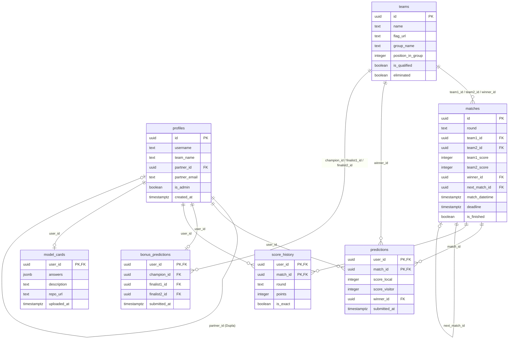
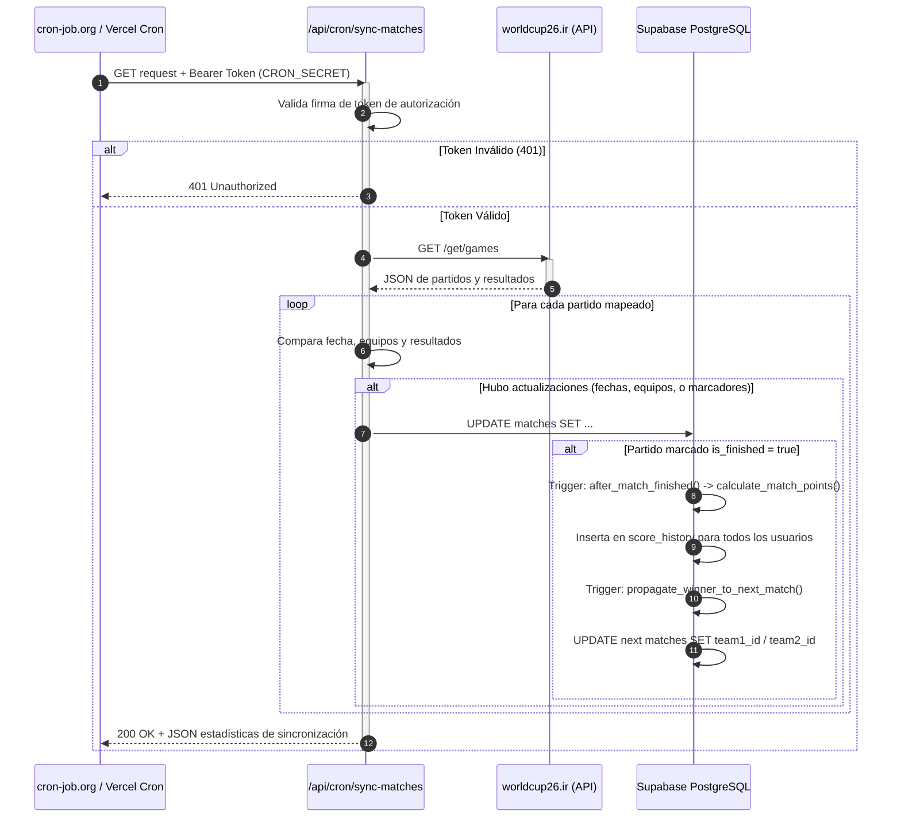

# 📖 Documentación Técnica — La Polla Mundial 2026 (Synaptica)

Esta documentación proporciona una especificación técnica profunda de la arquitectura de la aplicación, el diseño de la base de datos en Supabase, los flujos automáticos de sincronización y puntuación, el enrutamiento de seguridad y la estructura de componentes.

---

## Tabla de Contenidos

1. [Arquitectura de la Aplicación](#1-arquitectura-de-la-aplicación)
2. [Modelo de Base de Datos (Esquema ER)](#2-modelo-de-base-de-datos-esquema-er)
3. [Descripción y Estructura de Tablas](#3-descripción-y-estructura-de-tablas)
4. [Triggers y Procedimientos en PostgreSQL](#4-triggers-y-procedimientos-en-postgresql)
5. [Políticas de Seguridad de Fila (RLS)](#5-políticas-de-seguridad-de-fila-rls)
6. [API Interna (Endpoints de Sincronización)](#6-api-interna-endpoints-de-sincronización)
7. [Middleware y Flujo de Sesión](#7-middleware-y-flujo-de-sesión)
8. [Lógica de Puntuación y Reglas de Desempate](#8-lógica-de-puntuación-y-reglas-de-desempate)
9. [Módulo Analítico: Model Card](#9-módulo-analítico-model-card)

---

## 1. Arquitectura de la Aplicación

La aplicación está construida sobre el framework **Next.js 15** utilizando el paradigma de **App Router** y es desplegada como Serverless en **Vercel**. Toda la persistencia, autenticación de usuarios y lógica transaccional de negocio pesada reside en **Supabase** (PostgreSQL).

```
┌─────────────────────────────────────────────────────┐
│                   CLIENTE (Browser)                  │
│         Next.js 15 App Router · Tailwind CSS         │
│         Framer Motion · Recharts · shadcn/ui         │
└──────────────────────┬──────────────────────────────┘
                       │ HTTP / RSC
┌──────────────────────▼──────────────────────────────┐
│                  VERCEL (Serverless)                  │
│                                                       │
│  ┌──────────────────┐   ┌──────────────────────────┐ │
│  │  App Pages (RSC) │   │   API Routes (Serverless) │ │
│  │  /dashboard/*    │   │   /api/cron/sync-matches  │ │
│  │  /auth/*         │   │   /api/cron/update-...    │ │
│  └────────┬─────────┘   └──────────┬───────────────┘ │
│           │ Supabase SDK            │ fetch()          │
└───────────┼─────────────────────────┼────────────────┘
            │                         │
┌___________▼_____________┐  ┌________▼______________┐
│   SUPABASE (PostgreSQL)  │  │  worldcup26.ir (API)  │
│                          │  │  Resultados Mundial   │
│  Tables, RLS, Triggers   │  └───────────────────────┘
└──────────────────────────┘
```

---

## 2. Modelo de Base de Datos (Esquema ER)

El siguiente diagrama detalla las relaciones de clave foránea, cardinalidades y restricciones entre las tablas administradas en el esquema de base de datos de Supabase.



---

## 3. Descripción y Estructura de Tablas

### 3.1 `public.profiles`
Contiene la información de los perfiles de usuario. Se crea automáticamente un registro mediante un trigger PostgreSQL enlazado al esquema `auth.users` de Supabase Auth.
- `id` (UUID, PK): Vinculado directamente a `auth.users.id`.
- `username` (TEXT, UNIQUE): Nombre legible para mostrar en el Leaderboard.
- `team_name` (TEXT): Nombre descriptivo de la dupla o equipo individual.
- `partner_id` (UUID, FK, Nullable): Apunta al `id` del compañero si el usuario juega en dupla.
- `partner_email` (TEXT, Nullable): Correo electrónico del compañero invitado para sincronizar perfiles.
- `is_admin` (BOOLEAN): Define privilegios de administración del sistema (CRUD de partidos y visualizaciones analíticas).

### 3.2 `public.teams`
Catálogo de los 32 seleccionados nacionales clasificados a la Copa Mundial.
- `id` (UUID, PK): Identificador único del equipo.
- `name` (TEXT, UNIQUE): Nombre oficial de la selección (en español).
- `flag_url` (TEXT): URL pública de la bandera del país.
- `group_name` (TEXT): Identificador del grupo (de la 'A' a la 'L').
- `position_in_group` (INTEGER): Posición actual en el grupo (1 a 4).
- `is_qualified` (BOOLEAN): `true` si el equipo clasifica matemáticamente a Ronda de 32.
- `eliminated` (BOOLEAN): `true` si el equipo ya no cuenta con posibilidad de avanzar.

### 3.3 `public.matches`
Almacena el fixture completo de la fase eliminatoria directa (Round of 32 a la Final).
- `id` (UUID, PK): Identificador del partido (se utilizan UUIDs fijos en el seed de datos).
- `round` (TEXT): Etapa: `round_32`, `round_16`, `quarter`, `semi`, `final`, `third_place`.
- `team1_id` / `team2_id` (UUID, FK, Nullable): Apuntan a `teams.id`. Son null hasta definirse los cruces.
- `team1_score` / `team2_score` (INTEGER, Nullable): Goles reales al finalizar los 90 minutos reglamentarios (o 120 min de prórroga).
- `winner_id` (UUID, FK, Nullable): Equipo que clasifica a la siguiente fase (indica ganador en penaltis en caso de empate).
- `next_match_id` (UUID, FK, Nullable): Apunta al `matches.id` del siguiente cruce donde avanzará el ganador de esta llave.
- `match_datetime` (TIMESTAMPTZ): Fecha y hora del silbatazo inicial.
- `deadline` (TIMESTAMPTZ): Límite establecido para enviar predicciones (calculado como `match_datetime - 1 hora`).
- `is_finished` (BOOLEAN): Define si el partido ha finalizado y se deben procesar los puntajes.

### 3.4 `public.predictions`
Predicciones de marcadores y clasificados individuales de los usuarios.
- `user_id` (UUID, PK, FK): Perfil del participante.
- `match_id` (UUID, PK, FK): Partido predictivo.
- `score_local` / `score_visitor` (INTEGER): Goles estimados.
- `winner_id` (UUID, FK): Selección que el usuario predice que avanzará a la siguiente fase.

### 3.5 `public.score_history`
Registros históricos de puntos obtenidos por usuario en cada partido.
- `user_id` (UUID, PK, FK): Participante calificado.
- `match_id` (UUID, PK, FK): Partido calificado.
- `round` (TEXT): Ronda del partido (permite agrupaciones eficientes en gráficos).
- `points` (INTEGER): Puntos otorgados (0, 3, 5, o 7).
- `is_exact` (BOOLEAN): `true` si el marcador fue exacto.

---

## 4. Triggers y Procedimientos en PostgreSQL

La lógica de negocio transaccional y cálculo de puntos está delegada a triggers nativos en la base de datos para garantizar la integridad referencial y el rendimiento.

### 4.1 Cálculo Automático de Puntos (`on_match_finished`)
Disparador en la tabla `matches` al actualizar `is_finished = true`.

**Flujo lógico de base de datos:**
1. Lee todas las predicciones del partido finalizado (`match_id`).
2. Compara el marcador real (`team1_score`, `team2_score`) y el clasificado real (`winner_id`) contra la predicción del usuario (`score_local`, `score_visitor`, `winner_id` predicho).
3. Evalúa las siguientes reglas acumulativas:
   - **Marcador Exacto**: Si los goles de local y visitante coinciden exactamente → otorga **5 puntos** y registra `is_exact = true`.
   - **Resultado Correcto (Acierto de Ganador/Empate)**: Si el usuario acertó quién ganó el partido o si empataron (sin coincidir exactamente en goles) → otorga **3 puntos**.
   - **Clasificante Correcto**: Si el clasificado predicho coincide con el `winner_id` real → otorga **+2 puntos** adicionales.
   - **Predicción Incorrecta**: En cualquier otro caso → otorga **0 puntos**.
4. Inserta o actualiza el registro en `public.score_history` con el puntaje final calculado.

### 4.2 Propagación Automática de Llaves (`on_match_winner_propagation`)
Disparador en la tabla `matches` al actualizar `is_finished = true` y actualizar `winner_id`.

**Flujo lógico de base de datos:**
1. Identifica el partido de destino (`next_match_id`).
2. Determina si el partido actual alimenta al partido destino como local (`team1_id`) o visitante (`team2_id`). Esto se resuelve analizando el orden alfabético/numérico de los UUIDs de los dos partidos que apuntan al mismo `next_match_id`.
3. Ejecuta un `UPDATE` en el partido destino, inyectando el `winner_id` en la posición correspondiente.

---

## 5. Políticas de Seguridad de Fila (RLS)

Para garantizar la confidencialidad de las estrategias predictivas, la base de datos implementa políticas RLS.

### 5.1 Tabla `predictions`
- **SELECT**: Un usuario puede leer sus propias predicciones en cualquier momento. Solo puede leer las predicciones de otros usuarios si la hora actual supera la fecha límite del partido (`now() > matches.deadline`).
- **INSERT / UPDATE**: Permitido solo para el propietario de la predicción y únicamente si la hora actual es inferior a la fecha límite (`now() < matches.deadline`). Los administradores tienen deshabilitada la creación de predicciones.

### 5.2 Tabla `model_cards`
- **SELECT**: Visible públicamente para usuarios autenticados para fomentar la transparencia de las metodologías analíticas.
- **INSERT / UPDATE**: Permitido solo para el propietario del perfil y si la fecha actual es anterior al cierre de la pista analítica (17 de Julio de 2026).

---

## 6. API Interna (Endpoints de Sincronización)

La aplicación expone endpoints especiales para que cron jobs automatizados actualicen el estado del fixture.



### 6.1 `GET /api/cron/sync-matches`
Sincroniza los resultados e información de fechas con la API de `worldcup26.ir`.
- **Cabeceras obligatorias**: `Authorization: Bearer <CRON_SECRET>`
- **Comportamiento**:
  1. Descarga el listado de partidos de la API externa.
  2. Parsea las fechas (asumiendo huso horario del este de EE.UU. EDT - UTC-4) y ajusta los deadlines.
  3. Si la fase de grupos finalizó y los equipos del bracket eliminatorio están definidos, inyecta los IDs reales correspondientes de la BD.
  4. Si un partido de la API tiene el flag `finished = true`, actualiza los marcadores en `matches` y marca `is_finished = true`, disparando la cascada de puntos y propagación de llaves.

---

## 7. Middleware y Flujo de Sesión

El control de acceso reside en [`lib/supabase/proxy.ts`](file:///c:/Users/AndresToro/OneDrive - Synaptica/Synaptica_Mundial_2026/lib/supabase/proxy.ts).

### Flujo de Enrutamiento
1. Si el request apunta a un recurso estático (imágenes, CSS, JS) o a la ruta base de la API `/api/*`, el middleware **delega la solicitud**. Los endpoints de API validan su propio secreto.
2. Si el usuario **no tiene una sesión válida (cookie nula)**:
   - Se le permite ingresar a la página de bienvenida `/`, a las páginas de autenticación `/auth/*` y al favicon.
   - Si intenta acceder a `/dashboard/*`, se realiza una redirección temporal (HTTP 307) hacia `/auth/login`.
3. Si el usuario **tiene una sesión activa**:
   - Si intenta acceder a `/`, se le redirige automáticamente a `/dashboard` para mejorar la experiencia de usuario.

---

## 8. Lógica de Puntuación y Reglas de Desempate

El puntaje máximo por partido es de **7 puntos** (5 por marcador exacto + 2 por clasificado correcto).

### Ejemplo de Escenarios
Si un partido finaliza **Francia 2 - 1 Italia** (Francia clasifica):

| Predicción | Marcador Exacto (5 pts) | Resultado Correcto (3 pts) | Clasifica Correcto (+2 pts) | Puntaje Total |
|---|:---:|:---:|:---:|:---:|
| **Francia 2 - 1 Italia** (Gana Francia) | Sí | - | Sí | **7 pts** |
| **Francia 1 - 0 Italia** (Gana Francia) | No | Sí | Sí | **5 pts** |
| **Francia 2 - 2 Italia** (Gana Italia en penaltis) | No | No | No | **0 pts** |
| **Francia 1 - 1 Italia** (Gana Francia en penaltis) | No | No | Sí | **2 pts** |

---

## 9. Módulo Analítico: Model Card

Para la **Pista Analítica** de Synaptica, los usuarios registran un "Model Card" técnico antes del 17 de Julio de 2026. 

El panel de administrador consolida estas respuestas en un dashboard analítico con gráficos dinámicos de Recharts:
- **Distribución de Enfoques**: Gráfico circular (`PieChart`) que categoriza los enfoques predictivos mediante minería de palabras clave en la respuesta de la pregunta 3 (`Poisson`, `Machine Learning`, `Manual`, `ELO`, `Redes Neuronales`).
- **Orígenes de Datos**: Gráfico de barras (`BarChart`) que rastrea la popularidad de las fuentes de información utilizadas por los colaboradores para alimentar sus modelos.
