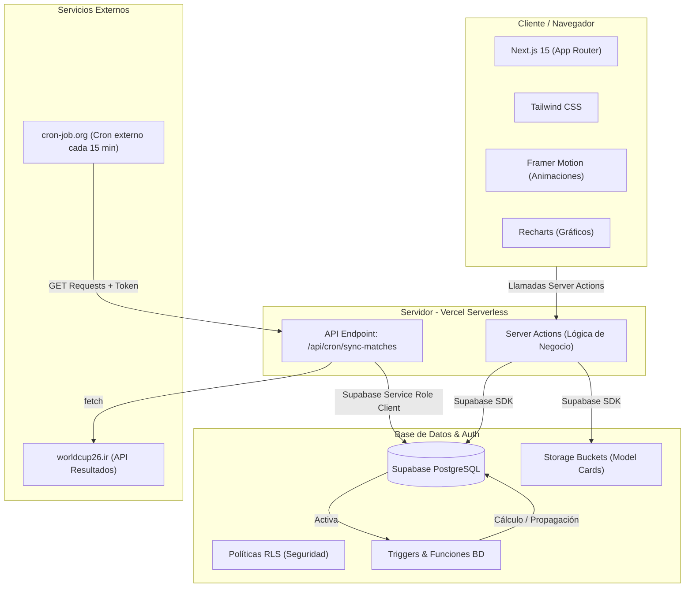

# 🌍 La Polla Mundial 2026 — Synaptica

<div align="center">

[](https://nextjs.org/)
[](https://supabase.com/)
[](https://www.typescriptlang.org/)
[](https://tailwindcss.com/)
[](https://vercel.com/)

**La Polla Mundial 2026 de Synaptica** es una plataforma predictiva corporativa interactiva y automatizada diseñada para la Copa Mundial de la FIFA 2026. Permite a los colaboradores realizar predicciones ronda a ronda, competir individualmente, visualizar el bracket de eliminación en tiempo real, y comparar metodologías de pronóstico a través de un módulo analítico avanzado ("Model Card").

[🌐 App en Producción](https://synaptica-mundial-2026.vercel.app) · [📖 Documentación Técnica](./DOCS.md) · [🚀 Guía de Despliegue](./DEPLOY.md)

</div>

---

## ⚙️ Arquitectura del Sistema

El siguiente diagrama detalla cómo se comunican las distintas capas de la aplicación: el cliente en React/Next.js, el servidor de Vercel Serverless, los servicios externos de sincronización de partidos, y la base de datos Supabase gobernada por políticas de seguridad RLS.



---

## ✨ Características Principales

| Módulo | Funcionalidad |
|---|---|
| 🔐 **Autenticación** | Registro e inicio de sesión seguros vía **Supabase Auth** con validación de correos corporativos. |
| 👥 **Modo de Juego** | Permite participar de manera **Individual** a nivel corporativo. |
| 🔮 **Predicciones Dinámicas** | Formulario ronda a ronda para pronosticar marcadores y ganadores de llaves, deshabilitándose automáticamente 1 hora antes de cada partido. |
| 🏆 **Bracket Interactivo** | Vista visual del árbol de eliminación directa (desde R32 a la Final) con modales interactivos para registrar predicciones y visualizar marcadores reales. |
| 📊 **Leaderboard en Vivo** | Tabla de clasificaciones en tiempo real que desglosa puntos totales, cantidad de marcadores exactos y evolución de rendimiento por rondas mediante gráficos de **Recharts**. |
| 🤖 **Sincronización Automática** | Cron job en segundo plano que consume la API oficial del torneo, actualizando equipos clasificados, marcadores y propagación de llaves. |
| 🃏 **Model Card Analítico** | Formulario metodológico de 7 preguntas técnicas donde los participantes documentan el enfoque de su modelo (Poisson, ML, ELO, Manual), alimentando un dashboard analítico para el administrador. |
| ⚙️ **Panel de Administración** | Consola exclusiva para gestionar usuarios, forzar sincronizaciones, resolver incidencias de cruces y analizar la distribución de metodologías. |

---

## 🛠️ Stack Tecnológico

- **Frontend**: Next.js 15 (App Router), React 19, TypeScript 5, Tailwind CSS, Lucide Icons, Radix UI (shadcn/ui), Framer Motion.
- **Backend / API**: Next.js Server Actions, Next.js API Routes.
- **Base de Datos**: Supabase PostgreSQL, Row Level Security (RLS), Triggers nativos, PostgreSQL Functions.
- **Autenticación & Almacenamiento**: Supabase Auth, Supabase Storage (para archivos y recursos de Model Cards).
- **Integraciones y Automatización**: API `worldcup26.ir` y servicio de disparo cron job `cron-job.org`.

---

## 📂 Estructura del Proyecto

```
synaptica_mundial_2026/
├── app/                          # Rutas y páginas de Next.js (App Router)
│   ├── api/
│   │   └── cron/
│   │       ├── sync-matches/     # 🤖 Sincronización automática de resultados
│   │       └── update-standings/ # 📊 Sincronización de estadísticas de grupos
│   ├── auth/                     # Flujo de login, registro e inicio de sesión
│   └── dashboard/                # Aplicación protegida principal
│       ├── bracket/              # Visualizador del árbol de eliminación
│       ├── predictions/[round]/  # Formularios de predicciones por ronda
│       ├── leaderboard/          # Tabla de posiciones y gráficos
│       ├── model-card/           # Formulario analítico del usuario
│       └── admin/                # Panel de administración (usuarios, equipos, partidos)
├── components/                   # Componentes React reutilizables
│   ├── admin/                    # Formularios y listados de administración
│   ├── bracket/                  # Nodos y conectores visuales del bracket
│   ├── dashboard/                # Estadísticas rápidas y contenedores de shell
│   ├── leaderboard/              # Tablas y gráficos de rendimiento (Recharts)
│   └── prediction/               # Inputs de predicción y validación de plazos
├── lib/                          # Funciones auxiliares y lógica del servidor
│   ├── actions.ts                # Server Actions documentadas con JSDoc
│   ├── utils.ts                  # Helpers de clases CSS y formateo
│   └── supabase/
│       ├── client.ts             # Cliente Supabase del lado del cliente
│       ├── server.ts             # Instancia Supabase para operaciones del servidor
│       └── proxy.ts              # Middleware para control de cookies y RLS
├── supabase/                     # Recursos y migraciones de Base de Datos
│   └── migrations/               # Scripts SQL de tablas, triggers y RLS
├── vercel.json                   # Configuración del servidor Vercel y crons nativos
└── DEPLOY.md / DOCS.md           # Guías exhaustivas de despliegue y documentación técnica
```

---

## ⚡ Inicio Rápido (Desarrollo Local)

### 1. Pre-requisitos
Asegúrate de contar con:
- **Node.js** v18 o superior instalado.
- Un proyecto activo en [Supabase](https://supabase.com).

### 2. Clonación e Instalación
```bash
# Clonar el proyecto
git clone https://github.com/Cracklord98/synaptica_mundial_2026.git
cd synaptica_mundial_2026

# Instalar dependencias
npm install
```

### 3. Configuración de Variables de Entorno
Copia el archivo de ejemplo y rellena con tus credenciales de Supabase:
```bash
cp .env.example .env.local
```
Edita `.env.local`:
```env
NEXT_PUBLIC_SUPABASE_URL=https://tu-proyecto.supabase.co
NEXT_PUBLIC_SUPABASE_PUBLISHABLE_KEY=tu-clave-anonima-publica
SUPABASE_SERVICE_ROLE_KEY=tu-clave-service-role-privada
CRON_SECRET=tu-secreto-de-seguridad-para-el-cron
```

### 4. Configurar la Base de Datos
Ingresa al SQL Editor de tu proyecto en Supabase y ejecuta los archivos de migración ubicados en `supabase/migrations/` en orden correlativo:
1. `20260616000000_init_schema.sql` (Crea el esquema base, tablas y políticas RLS).
2. `20260616000001_seed_data.sql` (Crea los 32 equipos y mapea la estructura de llaves inicial).
3. Ejecuta las migraciones adicionales de corrección (`...payment_columns`, `...delete_users`, `...winner_propagation`).

### 5. Iniciar Servidor de Desarrollo
```bash
npm run dev
```
La aplicación estará disponible en [http://localhost:3000](http://localhost:3000).

---

## 📊 Sistema de Puntuación

Las predicciones se puntúan automáticamente al finalizar cada partido basándose en la siguiente tabla:

| Acierto Realizado | Puntos Obtenidos |
|---|---|
| **Marcador Exacto** (ej: predice 2-1 y el partido finaliza 2-1) | **5 Puntos** |
| **Resultado Correcto** (ej: predice victoria local y el partido finaliza 1-0) | **3 Puntos** |
| **Clasificado Correcto** (independiente del marcador, acierta quién avanza de ronda) | **+2 Puntos** adicionales |
| **Ningún acierto** | **0 Puntos** |

*Ejemplo*: Si predices un empate `1-1` con el local avanzando en penales, y el partido queda `1-1` pero avanza el visitante, obtienes **5 puntos** por marcador exacto pero **0 puntos** por el clasificado (Total = 5 pts).

### Desempate en el Leaderboard
Si dos participantes empatan en puntaje acumulado, la posición se desempata bajo los siguientes criterios:
1. Mayor cantidad de marcadores exactos acertados (`exact_count`).
2. Mayor puntaje obtenido específicamente en la ronda **Final** (`final_points`).

---

## 🔒 Seguridad y Privacidad

- **Seguridad RLS (Row Level Security)**: Todas las tablas en Supabase restringen el acceso para evitar que los usuarios lee las predicciones de sus rivales antes de que el partido comience.
- **Deadlines Estrictos**: Las mutaciones de predicciones se rechazan a nivel base de datos y a nivel servidor una vez que el reloj supera la hora de cierre del partido.
- **Aislamiento de Administradores**: Los usuarios con privilegios de administrador (`is_admin = true`) no participan en la polla, no tienen predicciones activas ni se muestran en las clasificaciones para garantizar la transparencia.

---

## 👥 Contribución y Contacto

Este es un desarrollo exclusivo e interno para los colaboradores de **Synaptica**. Para reporte de bugs, sugerencias o soporte en la plataforma, por favor abre un Issue en este repositorio o contacta al administrador del sistema.
